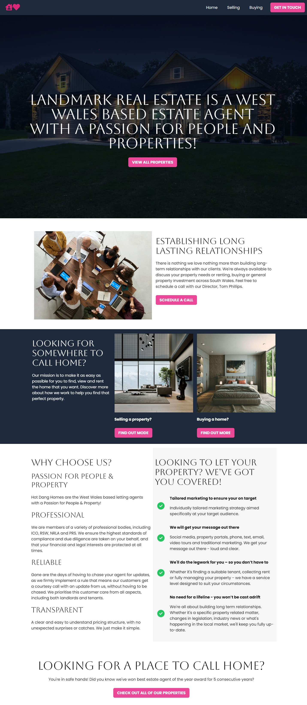
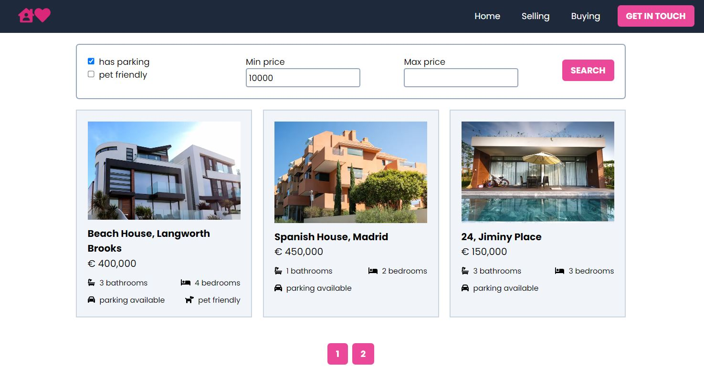
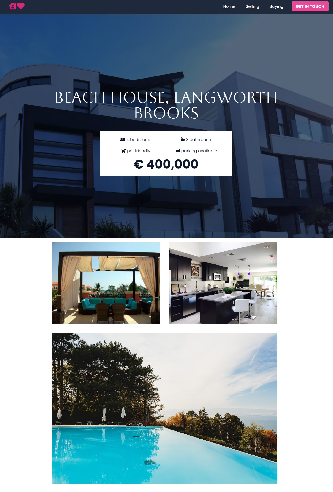

# Landmark Real Estate

Real estate property website

Technologies:

- NextJS + ReactJS
- GraphQL to query the data
- WordPress with custom Gutenberg blocks
- Tailwind CSS

## Screenshots

    <b>Home Page</b> 
    Containing information and usefull links to sub pages 
    

---

<b>All Properties Page</b> 
Filter the properties by min/max price, pet friendly and parking  

---

<b>Specific Property Page</b> 
Property containing its features and images 

